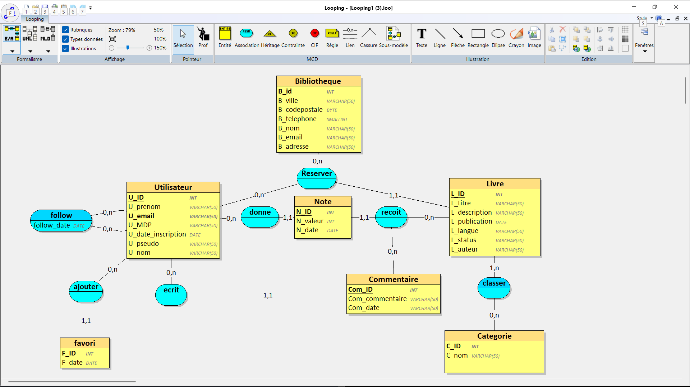

Prompt : 

Tu travailles dans le domaine du livre. 
Ta bibliothèque a comme activité d’offrir un service. 
C’est une bibliotheque comme la bibliotheque de Paris. La vie du prophete ,l’histoire du maroc avant l’indépendance, le saint coran ,Le mariage du petit Riad, Kara est la belle, Eloi est le kungfu. 
Inspire-toi d’un site web dans lequelle nous pouvons lire de livres gratuitement suivant : WEBCOMICS ,WEBTOON ,WATTPAD Ta bibliotheque veut appliquer MERISE pour concevoir un système d'information. 
Tu es chargé de la partie analyse, c’est-à-dire de collecter les besoins auprès de l’entreprise. 
Elle a fait appel à un étudiant en ingénierie informatique pour réaliser ce projet, tu dois lui fournir les informations nécessaires pour qu’il applique ensuite lui-même les étapes suivantes de conception et développement de la base de données.
D’abord, établis les règles de gestions des données de ta bibliotheque sous la forme d'une liste à puce.
Elle doit correspondre aux informations que fournit quelqu’un qui connaît le fonctionnement de l’entreprise, mais pas comment se construit un système d’information.
Ensuite, à partir de ces règles, fournis un dictionnaire de données brutes avec les colonnes suivantes, regroupées dans un tableau : signification de la donnée, type, taille en nombre de caractères ou de chiffres.
Il doit y avoir entre 25 et 35 données. 
Il sert à fournir des informations supplémentaires sur chaque donnée (taille et type) mais sans a priori sur comment les données vont être modélisées ensuite.
Fournis donc les règles de gestion et le dictionnaire de données.

1. Règles de gestion de la bibliothèque numérique :

La bibliothèque est un service de lecture en ligne inspiré de plateformes telles que WEBTOON, WEBCOMICS et WATTPAD.
Elle permet aux utilisateurs inscrits de consulter des livres organisés par catégories :

* Gestion des utilisateurs:

-Un utilisateur doit créer un compte pour accéder au service.
-Chaque utilisateur possède un identifiant unique.
-L’adresse email d’un utilisateur est unique.
-Un utilisateur possède un nom, un prénom, un email, un mot de passe et une date d’inscription.
-Un utilisateur peut consulter plusieurs livres.
-Un utilisateur peut noter un livre.
-Une note attribuée est comprise entre 1 et 5.
-Un utilisateur peut publier plusieurs commentaires.
-Un commentaire est associé à un utilisateur.

-Un utilisateur peut suivre d’autres utilisateurs (relation sociale).
-Un utilisateur peut créer plusieurs favoris.
-Un favori possède une date d’ajout.
-Un favori est associé à un utilisateur.

* Gestion des livres:
  
-Chaque livre possède un identifiant unique.
-Un livre possède un titre, une description, une langue et une date de publication.
-Un livre appartient à au moins une catégorie.
-Un livre peut appartenir à plusieurs catégories.
-Un livre peut être actif ou retiré du catalogue.
-Un livre peut recevoir plusieurs notes et commentaires.

* Gestion des catégories:

-Chaque catégorie possède un identifiant unique.
-Une catégorie peut contenir plusieurs livres.

* Gestion des commentaires:

-Un commentaire est associé à un utilisateur.
-Un commentaire possède un contenu et une date.
-Un utilisateur peut publier plusieurs commentaires.

* Gestion des notes:

-Un utilisateur peut attribuer une note.
-Une note est donnée par un utilisateur.
-Un livre peut recevoir plusieurs notes.
-Une note possède une valeur comprise entre 1 et 5.
-Un utilisateur ne peut attribuer qu’une seule note par livre.

* Gestion des bibliothèques

-La bibliothèque numérique comprend plusieurs bibliothèques physiques.
-Chaque bibliothèque possède un identifiant unique.
-Une bibliothèque possède un nom, une adresse, une ville et un code postal.

2. Dictionnaire de données brutes
Le tableau ci-dessous présente les données nécessaires au fonctionnement du système, sans présumer de leur organisation future dans les tables:

| Signification                | Type       | Taille |
| ---------------------------- | ---------- | ------ |
| Identifiant utilisateur      | Entier     | 10     |
| Nom utilisateur              | Texte      | 50     |
| Prénom utilisateur           | Texte      | 50     |
| Email utilisateur            | Texte      | 100    |
| Mot de passe utilisateur     | Texte      | 255    |
| Date inscription utilisateur | Date       | -      |
| Pseudonyme utilisateur       | Texte      | 50     |
| Identifiant livre            | Entier     | 10     |
| Titre livre                  | Texte      | 150    |
| auteur livre                 | Texte      | 100    |
| Description livre            | Texte long | 1000   |
| Date publication livre       | Date       | -      |
| Langue livre                 | Texte      | 30     |
| Statut livre                 | Texte      | 20     |
| Identifiant catégorie        | Entier     | 10     |
| Nom catégorie                | Texte      | 50     |
| Identifiant commentaire      | Entier     | 10     |
| Contenu commentaire          | Texte long | 500    |
| Date commentaire             | Date       | -      |
| Identifiant note             | Entier     | 10     |
| Valeur note                  | Entier     | 1      |
| Date note                    | Date       | -      |
| Identifiant favori           | Entier     | 10     |
| Date ajout favori            | Date       | -      |
| Identifiant bibliothèque     | Entier     | -      |
| Nom bibliothèque             | Texte      | 50     |
| Adresse bibliothèque         | Texte      | 100    |
| Ville bibliothèque           | Texte      | 50     |
| Code postal bibliothèque     | Entier     | -      |
| Email bibliothèque           | Texte      | 100    |
| Téléphone bibliothèque       | Entier     | -      |
| Date réservation             | Date       | -      |
| Date retour prévue           | Date       | -      |
| Date suivi                   | Date       | -      |

MCD : 

MLD : 

Utilisateur = (U_ID INT, U_prenom VARCHAR(50), U_email VARCHAR(50), U_MDP VARCHAR(50), U_date_inscription DATE, U_pseudo VARCHAR(50), U_nom VARCHAR(50));
Categorie = (C_ID INT, C_nom VARCHAR(50));
Commentaire = (Com_ID INT, Com_commentaire VARCHAR(50), Com_date VARCHAR(50), #U_ID);
favori = (F_ID INT, F_date DATE, #U_ID);
Bibliotheque_ = (B_id INT, B_ville VARCHAR(50), B_codepostale BYTE, B_telephone SMALLINT, B_nom VARCHAR(50), B_email VARCHAR(50), B_adresse VARCHAR(50));
Livre = (L_ID INT, L_titre VARCHAR(50), L_description VARCHAR(50), L_publication DATE, L_langue VARCHAR(50), L_status VARCHAR(50), L_auteur VARCHAR(50), #U_ID, #B_id);
Note = (N_ID INT, N_valeur INT, N_date DATE, #L_ID, #Com_ID, #U_ID);
classer = (#L_ID, #C_ID);
follow = (#U_ID, #U_ID_1, follow_date DATE);

## Scénario d’utilisation

La base de données représente une plateforme de lecture en ligne reliée à plusieurs bibliothèques.

Les utilisateurs peuvent :
- consulter des livres
- laisser des commentaires
- attribuer des notes
- suivre d'autres utilisateurs
- ajouter des livres en favoris

Le service marketing de la plateforme utilise la base de données pour analyser :

- les livres les plus populaires
- les catégories les plus consultées
- les notes attribuées par les utilisateurs
- l’activité des utilisateurs (commentaires, notes, favoris)
- les relations entre utilisateurs via le système de follow

Les requêtes SQL du fichier `4_interrogation.sql` permettent d’extraire ces informations afin d’aider la plateforme à améliorer ses recommandations et ses campagnes marketing.

